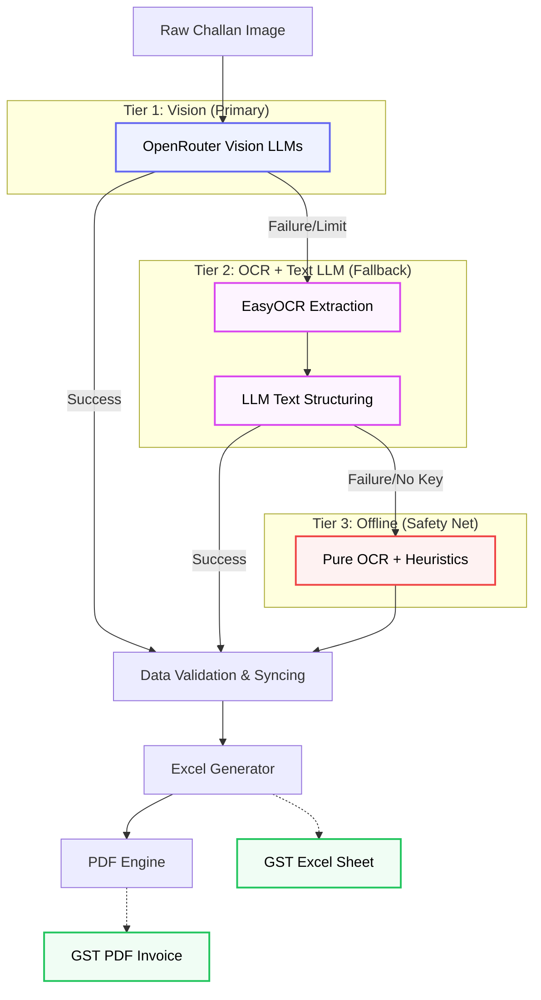

<div align="center">

# Invoice Generator

**Affordable GST-compliant invoicing for India's small businesses.**

[](https://python.org)
[](LICENSE)
[]()

---

*Small businesses in India can't afford big SaaS invoicing software.*
*Upload your raw delivery data or photos of handwritten challans → get a digitized, GST-compliant tax invoice instantly.*

</div>

---

## The Problem

Millions of small businesses across India — from building material suppliers to kirana stores — still rely on handwritten invoices. They can't afford expensive SaaS subscriptions. Without proper GST invoices, they risk non-compliance with tax laws.

**Invoice Generator** bridges this gap — a free, open-source tool that turns raw delivery records (Excel files or photos of challans) into professional, GST-compliant tax invoices in seconds.

---

## Features

- **Excel & Image Input** — Upload Excel data or photos of handwritten/printed challans
- **PDF Export** — Generate print-ready PDF invoices alongside Excel
- **Batch Processing** — Process entire folders with auto-incrementing invoice numbers
- **Config File** — Customize company, buyer, bank, GST via `config.yaml`
- **GST Compliant** — Auto-calculates CGST + SGST with HSN codes
- **AI/OCR Pipeline** — 3-tier fallback: Vision LLM → OCR + LLM → Pure OCR + heuristics
- **Smart Dates** — Auto-detects fiscal year, handles multiple date formats

---

## Quick Start

### 1. Clone & Install

```bash
git clone https://github.com/prshv1/invoice-generator.git
cd invoice-generator
pip install -r requirements.txt
```

### 2. Prepare Your Data

Create an Excel file (`.xlsx` or `.xls`) with these columns:

| Column | Description | Example |
|--------|-------------|---------|
| `Date` | Delivery date | `16/02/2025` |
| `Challan No.` | Receipt number | `1234` |
| `Vehicle No.` | Vehicle number | `5678` |
| `Site` | Delivery site | `Malad` |
| `Material` | Material type | `10 mm` |
| `Quantity` | Qty (tonnes) | `35.61` |
| `Rate` | Per tonne | `380` |
| `Per` | Unit | `Tonne` |

> Sample files included in [`Example Data/`](Example%20Data/)

### 3. Generate

```bash
# Interactive mode
python3 -c "from invoice_generator.cli import main_generator; main_generator()"

# Specify invoice number
python3 -c "from invoice_generator.cli import main_generator; main_generator()" -i 178

# Generate Excel + PDF
python3 -c "from invoice_generator.cli import main_generator; main_generator()" -i 178 --pdf

# Batch process all files in a folder
python3 -c "from invoice_generator.cli import main_generator; main_generator()" --batch ./data/ --start 178

# Batch with PDF output
python3 -c "from invoice_generator.cli import main_generator; main_generator()" --batch ./data/ --start 178 --pdf --output-dir ./invoices/
```

---

## Configuration

Customize `config.yaml` for your business — **no code editing required**:

```yaml
company:
  name: "YOUR COMPANY NAME"
  subtitle: "(BUSINESS TYPE)"
  address: "Your Address"
  contact: "9876543210"
  gstn: "00XXXXX0000X0XX"
  pan: "XXXXX0000X"

buyer:
  name: "BUYER NAME"
  address: "Buyer Address"
  gstn: "00XXXXX0000X0XX"

bank:
  account_name: "YOUR COMPANY"
  bank_name: "BANK NAME"
  account_no: "000000000000"
  branch: "BRANCH"
  ifsc: "XXXX0000000"

gst:
  cgst_rate: 0.09
  sgst_rate: 0.09
  hsn_code: 996511

unit: "Tonne"
```

---

## Python Module API

```python
from invoice_generator import generate_invoice, generate_pdf, batch_process

# Generate Excel workbook
wb = generate_invoice("data.xlsx", inv_num=178)
wb.save("Invoice_178.xlsx")

# Generate PDF
generate_pdf("data.xlsx", inv_num=178, output_path="Invoice_178.pdf")

# Get PDF as bytes (for web apps, email attachments, etc.)
pdf_bytes = generate_pdf("data.xlsx", inv_num=178)

# Batch process with custom config
config = {"company": {"name": "My Co"}, ...}
results = batch_process("./data/", start_num=100, pdf=True, config=config)
```

---

## Architecture Pipeline

The v0.3 image processor uses a 3-tier fallback architecture to ensure maximal extraction success under varying conditions (API rate limits, missing keys, or LLM failures):



---

## Project Structure

```
invoice-generator/
├── src/invoice_generator/
│   ├── core/
│   │   ├── config.py              # YAML config loader & defaults
│   │   ├── data_processing.py     # Data processing & GST calculations
│   │   └── image_utils.py         # Image preprocessing & base64 encoding
│   ├── extractors/
│   │   ├── json_parser.py         # JSON repair & parsing from LLM output
│   │   ├── llm_client.py          # OpenRouter LLM API client
│   │   ├── ocr_engine.py          # EasyOCR extraction engine
│   │   └── validator.py           # Data validation & syncing
│   ├── renderers/
│   │   ├── excel.py               # Excel invoice rendering engine
│   │   └── pdf.py                 # PDF invoice rendering
│   ├── __init__.py                # Public module API & exports
│   ├── cli.py                     # CLI argument parsing (argparse)
│   ├── extraction.py              # Image-to-Invoice pipeline
│   └── generation.py              # Excel-to-Invoice pipeline
├── Example Data/                   # Sample .xlsx input files
├── config.yaml                     # Business configuration
├── requirements.txt                # Python dependencies
├── todo.md                         # Development roadmap
├── .gitignore
└── README.md
```

---

## CLI Reference

```
usage: main_generator [-h] [-i INVOICE] [--input INPUT] [--output OUTPUT]
                             [--pdf] [--batch DIR] [--start START]
                             [--output-dir DIR] [--config CONFIG]

options:
  -h, --help       show this help message and exit
  -i, --invoice    Invoice number
  --input          Input Excel file (default: Example Data/Raw_Data.xlsx)
  --output         Output Excel file (default: Final_Output.xlsx)
  --pdf            Also generate PDF output
  --batch DIR      Batch process all Excel files in directory
  --start START    Starting invoice number for batch mode (default: 1)
  --output-dir DIR Output directory for batch mode
  --config CONFIG  Path to config YAML file
```

---

## Roadmap

- [x] ~~Config file for business details~~
- [x] ~~PDF export~~
- [x] ~~Batch processing with auto-numbering~~
- [x] ~~OCR support — upload photos of handwritten bills~~
- [ ] Web interface — browser-based upload & download
- [ ] Email integration — auto-send invoices to buyers
- [ ] IGST support — inter-state invoice detection

---

## Changelog

### v0.3.0 — March 2026

**New Features:**
- **Image Processor (AI/OCR)** — Extract structured data directly from photos of handwritten or printed delivery challans
- **3-Tier Fallback Architecture** — OpenRouter Vision LLMs → OCR + LLM text structuring → Pure OCR with heuristics
- **Batch Image Processing** — Create independent invoices recursively from photos using `--batch`

**Improvements:**
- LLM model cascading, exponential backoff, JSON repairs
- Exif auto-rotation, automatic deduplication, totals row filtering
- Reorganized project into modular `src/invoice_generator/` package

### v0.2.0 — March 2025

**New Features:**
- PDF export (`--pdf` flag)
- Config file — `config.yaml` for company/buyer/bank/GST customization
- Batch processing — `--batch` and `--start` flags
- CLI with argparse — proper flags: `-i`, `--pdf`, `--batch`, `--config`

**Improvements:**
- Extracted data processing into `process_input_data()` for reuse
- Config-driven templates (company, buyer, bank, GST rates from YAML)
- All features available as both CLI and importable Python functions

### v0.1.0 — March 2025

**Initial Release:**
- Core invoice generation engine
- Dynamic material support (no hardcoded lists)
- CGST/SGST auto-calculation with HSN codes
- Multi-site support with fiscal year detection
- Cross-platform date formatting

---

## Contributing

1. Fork the repository
2. Create your feature branch (`git checkout -b feature/amazing-feature`)
3. Commit your changes (`git commit -m 'Add amazing feature'`)
4. Push and open a Pull Request

---

## License

MIT — free to use, modify, and distribute.

---

<div align="center">

**Made with care for India's small businesses**

*If this tool helps your business, consider starring the repo!*

</div>
